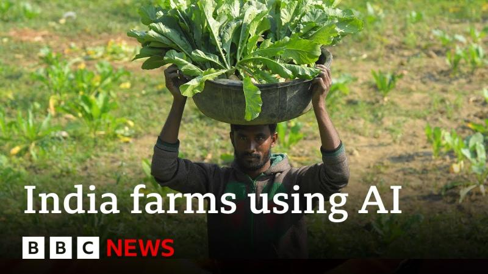

## IoT Systems Engineer

## Motivating Service Stories

### Smart Farming

 ([Image Source:](https://youtu.be/JeU_EYFH1Jk?si=x2zMg0Et47pJRAXn))

India has used traditional methods of agriculture for generations, but with 1.4 billion people now dependant on the crops farmers produce, some are turning to technology to boost productivity and profit.
For example on one vineyard, sensor devices are being used to check weather and soil health. Artificial intelligence (AI) can then figure out when it's time to water the crops, add fertiliser and tackle pests.
 
Nitin Patil, who works at the vineyard, says the AI advice has helped "save 50% of the water" the farm had been using previously.

[Artificial intelligence comes to farming in India BBC News](https://youtu.be/JeU_EYFH1Jk?si=x2zMg0Et47pJRAXn) (Video)

[These Bengaluru agritech startups are bringing AI and farmers together](https://youtu.be/sPhwu8KQ_Ac?si=V6JJCWPY4ngomA2_) (Video)

### The ultimate ‘smart’ device: the jet engine

 ([Image Source:](https://diginomica.com/blue-data-thread-connects-rolls-royce-customers-outcomes))

Rolls-Royce uses IoT to monitor over 13,000 jet engines, ensuring timely maintenance and improved efficiency. AI tools like Smart Discovery analyze vast data generated by connected engine components, aiding diagnostics and optimizing performance. Collaboration with NTU supports advancements in electrical systems, data analytics, and manufacturing. IoT and AI innovations enhance Rolls-Royce’s IntelligentEngine vision, transforming aviation through smarter technologies. This digital transformation drives actionable insights, enabling safer, more efficient engines while fostering a data-driven engineering culture.

[The ultimate ‘smart’ device: the jet engine](https://www.rolls-royce.com/media/our-stories/discover/2020/
intelligentengine-how-ai-scales-up-iot-capability-in-turbofan-jet-engines.aspx)

[Rolls-Royce: Embracing IoT on a wing and a prayer](https://d3.harvard.edu/platform-rctom/submission/rolls-royce-embracing-iot-on-a-wing-and-a-prayer/)

### Climate change
Smart forests use IoT and AI to combat threats like deforestation, wildfires, and poaching by embedding sensors, drones, and monitoring systems in forest ecosystems. These technologies detect environmental changes, send alerts, and support reforestation efforts with precision forestry techniques. Examples include Vodafone's systems in Romania and Greece for detecting illegal logging and wildfires and NASA's satellite-based FIRMS for wildfire monitoring. Innovations like drone-based tree planting by Flash Forest and wildlife monitoring systems enhance sustainability efforts. However, tackling legal activities like deforestation for agriculture remains a significant challenge, requiring greater civic and governmental engagement.

 ([Image Source:](https://www.ignitec.com/insights/can-smart-forests-save-themselves/))

[Smart Forests](https://youtu.be/fMOSDq9W_m8?si=UFO0K2D4WiYx6p7i)(Video)

[Can smart forests save themselves?](https://www.ignitec.com/insights/can-smart-forests-save-themselves/)

4. Predictive Maintenance 
[IoT Sensors and Predictive Maintenance](https://youtu.be/26cnTqheTyA?si=Qgp2YO6culNgzIjx)

## Roleplay for IoT Systems Engineer Job Profile: 

#### Scenario 1

**Objective:** Simulate real-world IoT tasks to enhance practical engineering skills, decision-making, and teamwork.  

---

**Scenario Overview:**  
Participants assume roles in a hypothetical IoT project aimed at designing a smart city application. This might include creating connected systems for energy management, traffic control, or environmental monitoring.  

**Roles:**  
1. **IoT Systems Engineer (Lead Role)**  
   - Oversee architecture and integration of IoT devices with cloud systems.  
   - Select hardware, software, and communication protocols (e.g., MQTT, LoRa).  

2. **Embedded Systems Engineer**  
   - Develop and deploy firmware for sensors and devices.  

3. **Data Engineer**  
   - Design data pipelines, ensuring real-time data flow and analytics readiness.  

4. **Cybersecurity Specialist**  
   - Implement secure IoT frameworks, encryption, and compliance with security standards.  

5. **Project Manager**  
   - Coordinate team activities, timelines, and deliverables.  

---

**Problem Statement:**  
The team is tasked with designing a smart energy grid monitoring system to optimize energy consumption and reduce wastage across a city.  

---

**Task Flow:**  
1. **Requirement Gathering:**  
   - Identify sensors needed for energy monitoring (e.g., smart meters).  
   - Define communication needs (Wi-Fi, Zigbee, etc.) and system constraints.  

2. **System Design:**  
   - The IoT Systems Engineer drafts the overall architecture.  
   - Decisions on edge computing vs. cloud computing and device-to-cloud integration.  

3. **Prototyping:**  
   - Hardware selection and testing.  
   - Writing test cases for sensor integration.  

4. **Deployment:**  
   - Configure devices for real-world conditions.  
   - Address connectivity and power optimization issues.  

5. **Issue Resolution:**  
   - Respond to challenges like latency, device failures, or data inconsistencies.  

---

**Trainer Feedback:**  
Trainers evaluate performance based on:  
- Problem-solving and design accuracy.  
- Communication and collaboration across roles.  
- Creativity in overcoming technical and logistical hurdles.  

**Outcome:**  
Participants gain hands-on experience in building scalable, secure IoT systems, with improved teamwork and a deeper understanding of real-world IoT challenges.

### Scenario 2

#### **Objective**
Simulate a critical task in IoT engineering involving system optimization, fostering practical expertise in troubleshooting and innovation within a complex IoT ecosystem.

---

#### **Scenario Setup**
1. **Project:** Deployment of a smart irrigation system for an agricultural farm.  
2. **Challenge:** The system is experiencing inconsistent sensor readings and high latency in data processing.  

---

#### **Problem Statement**
Participants must diagnose and resolve issues affecting the performance of soil moisture sensors and real-time irrigation controls. Constraints include limited power availability, variable network connectivity, and stringent customer requirements for minimal water waste.

---

#### **Collaboration Tasks**
- **IoT Systems Engineer Role:**  
   - Analyze data transmission workflows and identify bottlenecks.  
   - Propose optimized hardware (e.g., low-power sensors, efficient controllers).  
   - Implement a resilient edge-computing solution to reduce latency.  
- Work with a **Network Specialist** to evaluate connectivity options and with a **Data Analyst** for advanced predictive modeling.

---

#### **Execution**
- Conduct a simulated root-cause analysis of system inefficiencies.  
- Design and test a fault-tolerant architecture using edge computing and efficient routing protocols.  
- Implement upgrades to enhance reliability and scalability under real-world farm conditions.

---

#### **Outcome**
- **Technical Mastery:** Skills in edge-computing integration and troubleshooting IoT devices.  
- **Resilience Strategies:** Handling real-time data issues and implementing robust solutions.  
- **Collaboration Excellence:** Improved interdisciplinary communication and teamwork in a dynamic environment.  

This scenario strengthens core competencies of IoT Systems Engineers while addressing industry-relevant challenges.

### Scenario 3

### Roleplay for IoT Systems Engineer: Healthcare Sector

#### **Objective**
Simulate the design and deployment of a real-time IoT monitoring system in a healthcare setting, enhancing participants’ skills in system design, security, and patient-centric solutions.

---

#### **Scenario Setup**
1. **Project:** Implement a smart patient monitoring system for a hospital's intensive care unit (ICU).  
2. **Challenge:** The system must ensure seamless integration of wearable health devices, real-time alerts, and secure data storage while meeting strict healthcare compliance standards.  

---

#### **Problem Statement**
Participants are tasked with building an IoT system that collects data from wearable devices (e.g., heart rate monitors, blood pressure sensors) and alerts medical staff in case of anomalies. Challenges include maintaining data privacy, ensuring reliable connectivity, and designing user-friendly dashboards for healthcare professionals.

---

#### **Collaboration Tasks**
- **IoT Systems Engineer Role:**  
   - Architect a secure and scalable system to integrate wearable devices with a central server.  
   - Optimize data transmission protocols to handle real-time monitoring with minimal latency.  
   - Ensure compliance with healthcare data standards like HIPAA or GDPR.  
- Collaborate with **Cybersecurity Experts** to safeguard patient data and with **UI/UX Designers** to create intuitive interfaces.

---

#### **Execution**
- Prototype a system that collects, processes, and visualizes patient data in real-time.  
- Simulate emergency scenarios, such as detecting abnormal vitals and triggering immediate alerts.  
- Validate the system’s security measures and compliance readiness through mock audits.  

---

#### **Outcome**
- **Enhanced Technical Skills:** Expertise in designing secure, real-time IoT solutions tailored for healthcare.  
- **Compliance Knowledge:** Familiarity with healthcare regulations and data protection protocols.  
- **Team Collaboration:** Improved coordination with specialists in cybersecurity and user experience design.  

This scenario offers practical experience in creating life-critical IoT systems in the healthcare sector.