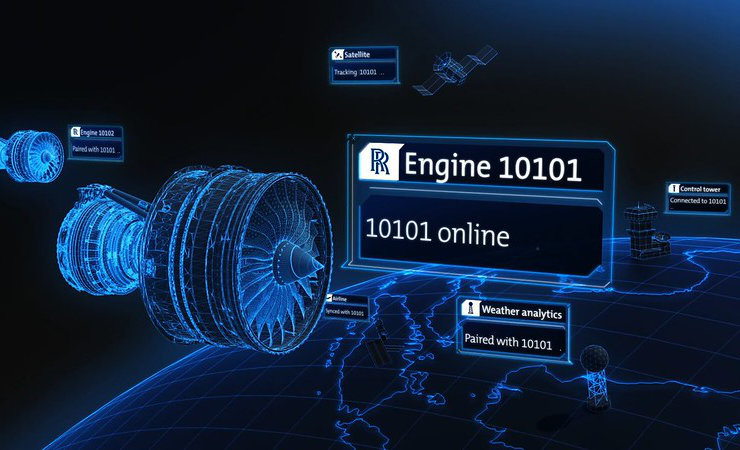
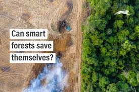

## IoT Systems Engineer

### Motivating Service Stories

### Smart Farming

 ([Image Source:](https://youtu.be/JeU_EYFH1Jk?si=x2zMg0Et47pJRAXn))

India has used traditional methods of agriculture for generations, but with 1.4 billion people now dependant on the crops farmers produce, some are turning to technology to boost productivity and profit.
For example on one vineyard, sensor devices are being used to check weather and soil health. Artificial intelligence (AI) can then figure out when it's time to water the crops, add fertiliser and tackle pests.
 
Nitin Patil, who works at the vineyard, says the AI advice has helped "save 50% of the water" the farm had been using previously.

[Artificial intelligence comes to farming in India BBC News](https://youtu.be/JeU_EYFH1Jk?si=x2zMg0Et47pJRAXn) (Video)

[These Bengaluru agritech startups are bringing AI and farmers together](https://youtu.be/sPhwu8KQ_Ac?si=V6JJCWPY4ngomA2_) (Video)

### The ultimate ‘smart’ device: the jet engine

 ([Image Source:](https://diginomica.com/blue-data-thread-connects-rolls-royce-customers-outcomes))

Rolls-Royce uses IoT to monitor over 13,000 jet engines, ensuring timely maintenance and improved efficiency. AI tools like Smart Discovery analyze vast data generated by connected engine components, aiding diagnostics and optimizing performance. Collaboration with NTU supports advancements in electrical systems, data analytics, and manufacturing. IoT and AI innovations enhance Rolls-Royce’s IntelligentEngine vision, transforming aviation through smarter technologies. This digital transformation drives actionable insights, enabling safer, more efficient engines while fostering a data-driven engineering culture.

[The ultimate ‘smart’ device: the jet engine](https://www.rolls-royce.com/media/our-stories/discover/2020/
intelligentengine-how-ai-scales-up-iot-capability-in-turbofan-jet-engines.aspx)

[Rolls-Royce: Embracing IoT on a wing and a prayer](https://d3.harvard.edu/platform-rctom/submission/rolls-royce-embracing-iot-on-a-wing-and-a-prayer/)

### Climate change
Smart forests use IoT and AI to combat threats like deforestation, wildfires, and poaching by embedding sensors, drones, and monitoring systems in forest ecosystems. These technologies detect environmental changes, send alerts, and support reforestation efforts with precision forestry techniques. Examples include Vodafone's systems in Romania and Greece for detecting illegal logging and wildfires and NASA's satellite-based FIRMS for wildfire monitoring. Innovations like drone-based tree planting by Flash Forest and wildlife monitoring systems enhance sustainability efforts. However, tackling legal activities like deforestation for agriculture remains a significant challenge, requiring greater civic and governmental engagement.

 ([Image Source:](https://www.ignitec.com/insights/can-smart-forests-save-themselves/))

[Smart Forests](https://youtu.be/fMOSDq9W_m8?si=UFO0K2D4WiYx6p7i)(Video)

[Can smart forests save themselves?](https://www.ignitec.com/insights/can-smart-forests-save-themselves/)

4. Predictive Maintenance 
[IoT Sensors and PPredictive Maintenance](https://youtu.be/26cnTqheTyA?si=Qgp2YO6culNgzIjx)

